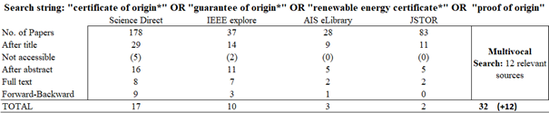
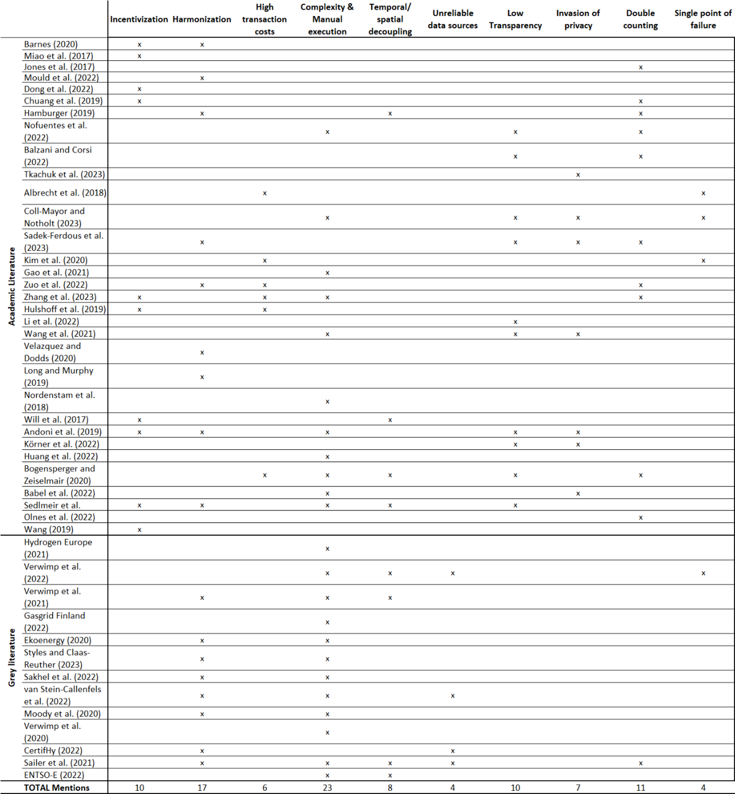

# Requirements analysis

The aim of the requirements analysis was to adequately describe the problem space of GO schemes that enable cross-carrier interoperability as described in both the knowledge base and the application domain, deducing requirements for the development of the solution artifact. The analysis employed a multi-vocal literature review, based on the principles of literature review laid out in (Webster und Watson 2002; Garousi et al. 2017) and the guidelines on the inclusion of grey literature in (Garousi et al. 2017). The literature review was multi-vocal in order to review the problem space as it has been analyzed in both theory and practice. This section is grouped into two parts: description of the problem space and deduction of requirements. A more detailed description of the method used can be found at the end of this document in the method section.

## Issues of a cross-carrier interoperable system of GO schemes

A total of 32 academic sources were identified from the review of the four databases, as well, as 12 grey literature sources (Table 2). Owing to the relative novelty of the topic of cross-carrier interoperability of GO schemes, the search on academic literature broadly reviewed issues of GO scheme and assessed their applicability to the energy carrier conversion scenario. The search on grey literature focussed specifically on sources investigating the cross-carrier interoperability topic. Following (Webster und Watson 2002), the issues identified from the multi-vocal literature review were structured into a concept matrix (Table 3).

**Low incentivization**

The need for higher incentivization is mentioned in papers that analyse the performance of one or several national GO schemes or provide policy recommendations for their home countries (Wang et al. 2019), (Hulshof et al. 2019), (Hamburger 2019). It is an issue relating to the regulatory framework of GO schemes, as opposed to their Information System and is not included in the deduction of the requirements, however, it is explained briefly for completeness.
Regulators do not sufficiently incentivize consumers by making scheme participation voluntary for energy suppliers and corporates and they do not sufficiently incentivize producers by allowing low-cost RES generation (e.g. from hydropower) to dictate market price. Several authors discuss the difference in outcome between voluntary markets and compliance markets (Wang et al. 2019; Hulshof et al. 2019), associating voluntary markets with significant economic inefficiencies. In compliance markets, GOs can be used to comply with a Renewable Portfolio Standard (RPS) or a corporate carbon-accounting measure. In the European Union, GO markets are voluntary and are additional to the compulsory quotas (Feed-in tariffs). (Hulshof et al. 2019) analyse the performance of the EECS market between 2001-2016, finding that they are in a constant state of oversupply with a significant number of certificates expiring unused. The same observation has been made with regards to the Chinese voluntary REC market (Wang et al. 2019). In recent years, the market deficit in the EU has gradually decreased (Brindley et al. 2021), which could be, among other things, the result of new corporate regulation, such as the Corporate Sustainability Reporting Directive (CSRD), increasing the demand for GOs (Brindley et al. 2021). The directive requires corporates to disclose Scope 2 emissions (i.e. from electricity, heating and cooling consumption) and mandates the use of “contractual arrangements” such as GOs or Power Purchase Agreements (PPAs) to prove renewable energy consumption.
Regulators also provide low incentivization for scheme participation to producers by not differentiating between quality levels of GOs, leading to overall low prices. Historically, GO prices ranged between 0.5€/MWh (Brindley et al. 2021; Wang et al. 2019) and 1.00€/MWh (Will et al. 2017). More recently, both as a result of rapid increase in demand and reduced supply due to lower asset productivity, GOs traded for as much as 10€/MWh in 2022 (van Diessen 2024). A large amount of RECs are supplied by hydropower plants in Scandinavia or the Alps which have very competitive production costs, leading to overall low REC-prices (Will et al. 2017). This disincentivizes other energy producers to invest into new renewable generation. To counteract this, certification agencies have constructed eco-labels that account for additional sustainability criteria of RES (Will et al. 2017). (Brindley et al. 2021) argue that most recently the demand for solar and wind GOs in Europe has outstripped GO supply, whereas hydropower GOs are in strong oversupply.

**Harmonization**

Harmonization is an issue that spans both the regulatory and IS layers of GO scheme design. Between European national schemes, harmonization is provided on the legal level by (European Commission 2018), on the semantic level by CEN16325 (van Stein-Callenfels et al. 2021) and on the technical by the AIB-HUB. As a result, interoperable processes and harmonization have been largely achieved for electricity GOs (Association of Issuing Bodies 2021), however, between GO schemes of other energy carriers it is lacking behind, largely because many EU countries have not even established GO schemes for these energy carriers. Hydrogen GO pilot schemes have so far been implemented only in one European country – the Netherlands (HyXchange 2022). For biomethane, ten European countries have established registries and eight countries have appoints Issuing Bodies, as of 2020 (Renewable Gas Trade Centre in Europe (REGATRACE) 2020). The extension of CEN16325 onto gas, hydrogen, and heating and cooling (AIB 2021) was only passed in 2021, which has not given scheme operators significant amounts of time to coordinate on harmonized GO scheme design. Missing harmonization among hydrogen, biogas and DHC GO schemes poses a significant problem for cross-carrier interoperability (Verwimp et al. 2021). While the EECS rules and the CEN16325 specify basic rules for energy carrier conversion (van Stein-Callenfels et al. 2021), there are no harmonized methodologies already being applied for cross-carrier conversion GO processes (Sailer et al. 2021). In a survey of AIB-member GO registry operators on GO interoperability for energy carrier conversion, harmonization was the most regularly mentioned concern (Verwimp et al. 2022). As a result, the scalability and automation of a system of GO schemes enabling cross-carrier interoperability will depend on the development of harmonized practices at the legal, semantic and technical level.

**High Transaction costs**

Several papers mention high transaction costs as an issue of GO scheme IS architectures operated by a monopolistic platform operator (Bogensperger und Zeiselmair 2020; Hulshof et al. 2019). The Association of Issuing Bodies (AIB) annually publishes a report on current tariffs charged by national GO scheme operators, showing that the average issuance fee of a 1MWh certificate in 2023 was 2.5ct and the average transferral fee was 1ct (Association of Issuing Bodies 2023). Assuming the historical average price between 50ct/MWh (Wang et al. 2019) and 1€/MWh (Will et al. 2017) per GO certificate, this equates to 3.5-7% transaction cost. Naturally, given the most recent price increase in GOs (van Diessen 2024) the transaction cost burden has lessened but whether prices continue to be elevated remains to be seen. Annual usage fees vary significantly between countries, but can be as high as €77,600 in Austria (Association of Issuing Bodies 2023). (Hulshof et al. 2019) find that higher fees are correlated with lower GO transaction volumes, suggesting that transaction costs limit the scalability of GO schemes, artificially increase price and inhibit their adoption. High transaction costs, especially high fixed costs such as annual usage fees, also inhibit the participation of small-scale prosumers, e.g. residential photovoltaics (Bogensperger und Zeiselmair 2020). A central registry for cross-border interoperability increases transaction costs even further. In the EU, the operating cost of cross-border asset transfer incurred by the AIB-Hub is charged to the national operators. As a result, the average transfer fee for imports and exports quoted by national operators is higher than for internal transfer (2.3ct compared to 1ct) (Association of Issuing Bodies 2023). As is the case with cross-border transfer, any IT-solution for cross-carrier transfer during energy carrier conversion is likely to increase fees to the end consumer, since the operating costs of the IT-solution will be charged to the national registry operators and reflected in the final GO fees to the end consumer, thereby limiting the scalability of the solution.

**Increased complexity and manual execution**

Several papers mention that current GO schemes, even in the absence of energy carrier conversion, are characterized by long GO approval cycles (Nofuentes et al. 2022; Zhang et al. 2023). For example, in Spain, the processing of issuing requests occurs only on a monthly basis (Nofuentes et al. 2022). This is the result of reliance on manual processes in the auditing of production plants and GO issuance and transfer (Andoni et al. 2019). The manual execution of tasks also increases the risk of human error (Andoni et al. 2019; Sailer et al. 2021). Energy carrier conversion processes will lead to increased complexity in the operation of GO schemes (Sailer et al. 2021), requiring a high level of automation or otherwise manual handling will inhibit the scalability of the future MCES (EKOenergy 2020). This increased complexity results from the fact that output GOs of conversion processes need to correctly inherit energy and emission attributes from input GOs as well as carry forward all additional relevant information (Verwimp et al. 2022). There are a significant number of different attribute inheritance scenarios (see Section 2.X.), conveying complex information (e.g. Energy Input Factor), which leads to an increasing number of relevant data points and increased complexity of data sharing. In fact, GO approval for production processes using more than one locally sourced input energy source already lead to time lags of several months in the EECS (Association of Issuing Bodies 2021).

**Temporal and spatial decoupling**

GOs are characterized by an overall low level of user acceptance (Hamburger 2019; Bogensperger und Zeiselmair 2020). End consumers of green electricity tariffs are wary of the temporal and spatial decoupling between GOs and physical energy (Sedlmeir et al. 2021; Johns 2021), that is inherent to the book-and-claim model. In addition, temporal decoupling, i.e. a 12-18 month GO validity period, sends wrong price signals to market participants as the GO price does not fluctuate in tandem with the effective volume of RES energy at any given time (ENTSO-E 2022) and it fails to incentivize time-specific consumption of renewable energy (Sedlmeir et al. 2021). As a result, it has been suggested to limit the validity period of GOs to 15 minutes (ENTSO-E 2022; Sedlmeir et al. 2021). This could increase the trust that end consumers have in the veracity of GOs. Trading GOs in almost real-time, however, poses significant scalability challenges, requiring automatic processing of issuing and transfer requests. In the cross-carrier interoperability scenario, a short GO validity period would disincentivize producers to store energy (e.g. in the form of hydrogen) for load flexibility provision, as their corresponding GO would expire. A future system of GO schemes will therefore have to be able to distinguish between short and long validity periods without impacting the trust that end consumers have in the system.  
Spatial decoupling, i.e. the absence of a local dimension to GOs, fails to incentivize large-scale RES deployment to occur in locations with suitable transmission capacities and to consider transmission losses (ENTSO-E 2022). As mentioned in 2.X, alternative energy carriers, such as DHC, suffer from higher transmission losses than electricity (Styles et al. 2021), therefore, in the cross-carrier interoperability scenario, the issue of spatial decoupling of GOs is aggravated. Including (averaged?) transmission losses in GO issuance would further increase the number and complexity of data points tracked throughout the system and thereby increase pressure on its scalability.

**Unreliable data sources**

The increase in unreliable data sources is an issue that arises only in alternative energy carrier GO schemes. In the electricity market, GOs are issued for energy output from registered production devices, however, the data is usually provided by the TSO or DSO (e.g. imbalance settlement data), constituting a single, trustworthy source for production data (van Stein-Callenfels et al. 2021). Rarely, production data might come directly from the producer’s export meter, in which case the issuing body or its appointees have to ensure its accuracy (e.g. through audit of the metering diagram) (van Stein-Callenfels et al. 2021). For alternative energy carriers, data provision by a single trustworthy source, e.g. the TSO of the gas grid, does not yet exist (Sailer et al. 2021). Furthermore, hydrogen and biogas might also be transported by road or ship, where data provision can only come directly from the producer. Different from electricity, no independent third-party metering devices are yet available for alternative energy carriers (Sailer et al. 2021) further impacting the trustworthiness of data provision. As a result, the CertifHy pilot scheme uses production data directly from the producers as a basis of GO issuance and conducts regular audits to ensure the validity of data (CertifHy 2022b). Audits usually occur on an annual basis (frequency may vary for producers with a good track record) and are performed by an auditor appointed by CertifHy. 10% of certificates are withheld from producers and only issued after the annual audit. Manual and physical audits, such as performed in the CertifHy scheme, impact the scalability of a future cross-carrier interoperable system of GO schemes. At the same time, since producers do not constitute trustworthy data sources, the verifiability of data at its origination needs to be ensured. In addition, GO conversion issuance requires proof of input energy metering data into the conversion device and, currently, this type of metering data is less available than production side metering (Verwimp et al. 2022). This means that input energy volumes, on which the cancellation of input GOs rests, for some producers, have to be calculated based on default conversion factors and efficiencies, which further undermines the trustworthiness of GO data (Verwimp et al. 2022).

**Lack of transparency**

Current GO schemes usually do not reveal information on the transfer history and origination of a GO (Li et al. 2022). For example, the German GO registry is not publicly accessible ((Bogensperger und Zeiselmair 2020; Umweltbundesamt 2018). As a result, GO customers are unable to verify the data on GOs transferred to them and the platform operator is the single source of truth on data. This provides significant potential for abuse by the operator (Andoni et al. 2019; Körner et al. 2022; Babel et al. 2022; Sedlmeir et al. 2021), reducing the trust that market participants have in the veracity of GO data. This problem is likely aggravated in the cross-carrier conversion scenario. Since production processes will become more complex and make use of GO-certified input energy carriers, the complexity of upstream GO issuance and transfer processes will increase and GO processes will occur across registries for different energy carriers (Gasgrid Finland 2022), increasing the potential points of system corruption. As result customers will be even more likely to question data veracity in the absence of end user verifiability.

**Double counting**

Authors in the literature have used the term double counting to refer to two separate phenomena: implicit double counting (Jones et al. 2017; Ølnes et al. 2022) and residual mix double counting (Hamburger 2019; Chuang et al. 2019). Energy carrier conversion introduces a third type of double counting, dubbed cross-carrier double counting (Sailer et al. 2021).
Residual mix double counting means that renewable energy attributes, already consumed via a GO, can be included in an energy supplier’s disclosure statement. Disclosure statements use statistical generation mix data, referred to as residual mix data, to calculate the emission intensity of their residual energy supply (i.e. non-certified supply) to end consumers. If the energy certified via GOs is not excluded from the statistical generation mix data, energy suppliers effectively count this energy twice. For electricity GOs, this regulatory oversight has been remedied and residual mix calculations for the electricity market are provided by the AIB. The issue was last reported to have occurred in the UK in 2015 (Hast et al. 2015). However, cross-carrier GO interoperability for energy carrier conversion might reintroduce the problem. Conversion processes will have to use residual mix calculations for all non-certified input energy, however, methods of residual mix calculation for energy carriers other than electricity are not yet implemented (EKOenergy 2020; Styles und Claas-Reuther 2023).
Implicit double counting refers to the belief of consumers that they are consuming green electricity although the renewable energy attributes associated with this electricity are sold elsewhere. In the US, double marketing of photovoltaics GOs by solar panel installers has been recorded. Solar panel installers will lease solar panels to the residential home owners (hosts) and strip the renewable attributes of the solar energy from the host by selling it in the form of a GO, which the hosts are usually completely oblivious to (Jones et al. 2017). In Norway, there exists a similar phenomenon of implicit double counting. Although 98% of Norwegian energy production is renewable as of 2020, the reported energy consumption mix was 59% fossil, 30% nuclear and only 11% renewable (Ølnes et al. 2022). Since Norwegian regional energy providers and end consumers know that their electricity is renewable, there is no added benefit from purchasing GOs and declaring it as such. Instead, GOs from Norwegian renewables are sold to energy consumers in other European countries. Implicit double counting is not an IS issue, since it exploits the ill-informedness of end consumers about GOs.
Energy carrier conversion introduces a third type of double counting. Renewable energy attributes might be duplicated between GO schemes of different energy carriers if input GOs into a conversion process are not cancelled or GO information is not correctly transposed between schemes (Sailer et al. 2021). In the absence of verifiability measures, this would harm the trust end consumers have into the GO scheme.

**Invasion of privacy**

Invasion of privacy is mentioned as an issue of GO scheme IS architectures in a number of papers. Market participants are required to reveal large amounts of private information to the platform owner (Körner et al. 2022), who stores it in a centralized database. Access to the data is controlled by the platform owner meaning that market participants cede their data sovereignty (Coll-Mayor und Notholt 2023). In the cross-carrier conversion scenario, private information (including identity information) of market participants will have to be shared across the registry operators of different energy carriers (Verwimp et al. 2022). For example, registry operators issuing an output GO of a conversion process will have to be able to verify the veracity of private production information related to the input GO in the registry for the input energy carrier (Verwimp et al. 2021). Another example is that, in the case of cogeneration (e.g. combined heat and power), where two output GOs are issued in separate registries, registry operators might wish to verify the correct issuance of the other output GO in its registry, wherefore they would need to link the identities of account holders across registries. In the absence of privacy-preserving verifiability mechanisms, this will increase the number of entities with access to the private information of market participants.

**Single point of failure**

A centralized IS-architecture, structured around a single platform owner, comes with potential security issues as it provides a single point of failure (Albrecht et al. 2018). A single platform owner is likely to store data in a single centralized database that provides a target for cyberattacks (Coll-Mayor und Notholt 2023). Furthermore, centralized access to the database means that an internal security threat through e.g. an employee of the platform owner could lead to the corruption of all data at once. In the cross-carrier scenario, particularly if a central conversion registry were to be employed as the preferred IT-solution (see Section 2.2.2.), the single point of failure issue persists or might even be aggravated.

## Requirements for the solution artifact

Through the multi-vocal literature review, the problem space relating to GO scheme design for cross-carrier interoperability was delineated. Following (Hevner 2007), in this section, the requirements of the solution artifact are derived from the issues described in Section 4.1. To evaluate the current artifact after each design cycle, it will be compared against this set of requirements.
Scalability and Automation 
The description of the problem space has indicated that current GO schemes are not scalable, owing to high transaction costs and manual processes, reflected in long GO approval cycles. GO schemes of alternative energy carriers further suffer from a low maturity and harmonization, as well as unreliable data sources, since data is provided by the producer, entailing cumbersome auditing procedures. Cross-carrier interoperability introduces an increased complexity and data throughput as a result of attribute inheritance between input and output GOs, aggravating the issue of manual processes, as well as adding an additional layer of operating costs onto the already substantial transaction costs. Time-granular and spatially-aware certificates, a proposed solution hoping to increase the attractiveness of GOs to the end consumer, further increase the complexity and data throughput of the system. Therefore, the solution artifact will have to enable a high data throughput and the automated handling of complex GO issuing requests at low operating cost.
Verifiability and Trust
Current GO schemes are not transparent to market participants, allowing the potential for abuse and thereby damaging the trust that end consumers have in the system. With the introduction of energy carrier conversion processes, the potential points of system corruption will increase, as will the risk of double counting between schemes, further decreasing the trust of market participants in the absence of verifiability measures. Furthermore, alternative energy carrier GO schemes rely on the producers as data sources, who do not constitute a trustworthy source of data. Therefore, the solution artifact will have to enable end-to-end verifiability by all market participants that creates trust into the system. At the same time, given that GO schemes use private confidential information of its participants, the transparency implicit in the verifiability requirement should not impact the privacy of market participants.
Privacy
Scheme participants reveal significant amounts of private information to scheme operators. A solution artifact will have to preserve the privacy of scheme participants, while enabling the verifiability of GO information.
Security
Current GO schemes, as well as current and proposed IT-solutions for cross-border and cross-carrier interoperability, employ centralized IT architectures with a centralized database. These suffer from the single point of failure problem as laid out in the previous section. The solution artifact should therefore improve the security of a system of GO schemes enabling cross-carrier interoperability

## Motivating the Use of blockchain

Distributed Ledger Technology enables trustless data sharing and digital asset transfer without a centralized, supervising authority. Through transparent and immutable storage of data, DLT creates an environment where no trust between stakeholders is necessary (Andoni et al. 2019; Nofuentes et al. 2022; Balzani und Corsi 2022). Further, it simplifies the automatic execution of transactions, reducing risks associated with insufficient authentication or manual processes (Strüker et al. 2022; Balzani und Corsi 2022). The suitability of DLT for energy GO scheme application has been highlighted, among others, in (Sedlmeir et al. 2021; Albrecht et al. 2018; Knirsch et al. 2020; Coll-Mayor und Notholt 2023).
However, a number of papers argue that the use of DLT is simply not necessary or too resource-intensive in energy markets application, because existing IS-architectures adequately fulfil the same purpose at a smaller implementation cost. In their study on future IT systems for harmonized energy carrier GO schemes, (Moody et al. 2020) reject blockchain-based architectures as “a solution without a problem” (p. 53)

**Core (general) strengths of Blockchain Technology mentioned in reviewed literature**

Decentralization/decentralized trust (Balzani und Corsi 2022),(Andoni et al. 2019),(Tkachuk et al. 2023),(Ferdous et al. 2023),

Transparency/data auditability (Nofuentes et al. 2022), (Balzani und Corsi 2022),(Andoni et al. 2019), (Tkachuk et al. 2023)

Privacy (Nofuentes et al. 2022),(Balzani und Corsi 2022),(Tkachuk et al. 2023);

Execution automation (Nofuentes et al. 2022),(Balzani und Corsi 2022),

Immutability (Balzani und Corsi 2022)

Prevent double spending (Andoni et al. 2019)

**Mapping between requirements and DLT components**

Scalability and Automation Scalability: On-chain data minimization; scalable consensus (e.g. Hyperledger endorsement policy);
Automation: Smart contracts
Verifiability & Trust Decentralized Identity Mgmt; Digital Signatures; ZKPs; Smart Contracts;
Privacy ZKPs
Security Decentralized by nature; cryptographic primitives - hash functions

## Method

The aim of the requirements analysis was to adequately describe the problem space of GO schemes that enable cross-carrier interoperability through a structured multi-vocal literature review and deduce requirements for the development of future schemes. A multi-vocal approach was employed, because the pro
To this end, the guidelines laid out in (Webster und Watson 2002) were followed, conducting a forward and backward search on the articles selected from the databases and extracting concepts relevant to the literature review focus area in the form of a concept matrix (Fig. 2). Research into GO schemes and multi-carrier energy systems is interdisciplinary, wherefore the initial search is conducted in four databases: ScienceDirect, Association for Information Systems (AIS) eLibrary, Institute of Electrical and Electronic Engineers (IEEE) Xplore Digital Library, and JSTOR. The initial search aimed to identify papers that mention both multi-carrier energy systems and GO schemes in their metadata (title, abstract, and keywords). Therefore, I employed the string: (“multi-carrier energy system” OR “energy hub” OR “smart energy system” OR “sector coupling”) AND (“guarantee of origin” OR “proof of origin” OR “certificate of origin” OR “renewable energy certificate”) as well as using the \* wildcard on all search terms to find articles using terms in the plural. This search, as well as other closely related search strings, yielded zero results across all databases, suggesting that the topic of cross-carrier interoperability has not been directly tackled in the academic literature.
As a result, I decided to employ a multi-vocal literature review, including 1st tier grey literature, specifically government regulations, supra-national standards and project-reports from publicly funded initiatives, following the guidelines laid out in (Garousi et al. 2017), as well as reviewing the research field of GO schemes in the academic literature more broadly. I employed the string “certificate of origin” OR “guarantee of origin” OR “renewable associated with design energy certificate” OR “proof of origin” in order to identify and categorize requirements of GO schemes in the different energy carriers. General requirements mentioned in the literature were assessed regarding their applicability to cross-carrier interoperability. The results from this search were clustered into two concept matrices (Fig.X and Fig Y), one summarizing general requirements of GO schemes, applicable to the focus area, the other summarizing requirements, associated specifically with an interoperable system of different energy carrier GO schemes. The search on grey literature employed a specific focus on requirements of cross-carrier interoperability.
Papers dating from before 2017 were excluded because the guarantee of origin and MECS fields are rapidly evolving, both in research and in practice. For example, (Hamburger 2019) mentions lack of regulatory harmonization among EU member states as a an issue leading to lower trust and lower cross-border interoperability, citing the fact that nine EU member states have not adopted the AIB-mandated standards on GO scheme design. Since its publication, six of those nine member states have joined the AIB, rendering the argument largely irrelevant.
