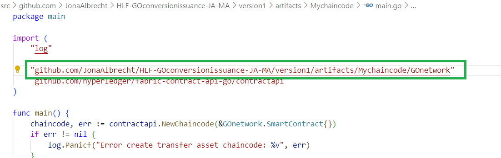

## 1. Installing all Prequisites, Fabric-Sample, Binaries and Docker Images

Im using ubuntu version 22.04 (amd64), docker version 25.0.4, docker-compose version 1.26.2, nodejs 18.X, go 1.22.1, npm 10.2.4, python 2.7.18

For best comparability and to ensure minimal necessity for troubleshooting, I would recommend to setup a completely empty virtual machine instance [create a virtual machine](Virtual-Machine-Setup.md) with ubuntu 22.04. If you are using a local WSL:Ubuntu connection, please make sure you are using a Ubuntu amd64 Operating System and not Debian or a 32bit version. Assuming you decide against using a virtual machine hosted on the Google Cloud platform, if you do not have WSL installed, you need to execute `wsl --install` in a Windows Powershell terminal. 

Open a terminal on your WSL:Ubuntu connection or your SSH:virtual machine connection. 

Open the folder /usr/local when prompted to select a directory. You can always change the current working directory displayed by VS Code by File>Close Folder. Then clicking on Explorer (top icon of the left sidebar), click "open folder".

We now need to install all the prerequisites:

`sudo apt-get install curl`

Lets first install Nodejs. You can skip this step if you already have Nodejs installed. We need to download the correct APT repository using:

`curl -sL https://deb.nodesource.com/setup_18.x | sudo -E bash -`

And then running: 

`sudo apt-get install nodejs`

Using this method to install node, it should also include an installation of npm, the package manager for Node. Check NPM is installed by running `npm --version`.

If it is not installed, you can do so by running: `sudo apt-get install npm`

**Docker**

Im using the "install using the apt repository" method from the [Docker documentation](https://docs.docker.com/engine/install/ubuntu/) to install docker

`sudo apt-get update`
`sudo apt-get install ca-certificates curl`
`sudo install -m 0755 -d /etc/apt/keyrings`

`sudo curl -fsSL https://download.docker.com/linux/ubuntu/gpg -o /etc/apt/keyrings/docker.asc`

`sudo chmod a+r /etc/apt/keyrings/docker.asc`

In this next command, make sure there are no line-breaks when copying it into the terminal

`echo "deb [arch=$(dpkg --print-architecture) signed-by=/etc/apt/keyrings/docker.asc] https://download.docker.com/linux/ubuntu $(. /etc/os-release && echo "$VERSION_CODENAME") stable" | sudo tee /etc/apt/sources.list.d/docker.list > /dev/null`

`sudo apt-get update`

`sudo apt-get install docker-ce docker-ce-cli containerd.io docker-buildx-plugin docker-compose-plugin docker-compose`

`docker --version`
`docker-compose --version`

**Golang Installation**
Please install go into /usr/local/ as opposed to /home/yourusername/. It is a golang community recommendation to install into usr/local/go [see GO install](https://go.dev/doc/install) and the main.go and the go.mod file (HLF-GOconversionissuance-JA-MA/version1/artifacts/Mychaincode) of my project depend on this filepath. If you install into a different filepath, you will need to delete the go.mod file and reinstall using `go mod init`. It is also not certain that this will work at all as the conversion.go chaincode file gets modularized as a github module to be successfully imported from the GO website in the main.go file [online link of the conversion chaincode module](https://pkg.go.dev/github.com/JonaAlbrecht/HLF-GOconversionissuance-JA-MA/version1/artifacts/Mychaincode/GOnetwork).

We cant follow the normal [installation method](https://go.dev/doc/install) of downloading the tar ball onto our machine bc we are in a virtual environment. The next two commands download the appropriate tar ball and install it:

`sudo wget https://go.dev/dl/go1.22.1.linux-amd64.tar.gz -O go.tar.gz` 

and then 

`sudo tar -xvzf go.tar.gz`

We need to set the GOPATH to the Go-Folder. Put the following lines into both your .bashrc and your .profile file, which configure the terminal. You might not be able to find the .bashrc file in usr/local/ and might have to swap to home/yourusername/ folder of the linux folder structure using 

`cd ../../home/yourusername`

Then open the .profile file in an editor using either : 

`sudo nano ~/.profile`
or navigate to the file in the VS Code explorer by closing the current folder and opening home/yourusername/ (in my case home/jonalinux1/) as explained above.

and then add the below lines into the .bashrc and the .profile file at the bottom.

`export GOPATH=usr/local/go`

`export PATH=$PATH:/usr/local/go/bin`

Since later on we will need this as well, also add this line to .profile and .bashrc:

`export PATH=$PATH:/usr/local/go/src/github.com/JonaAlbrecht/fabric/fabric-samples/bin`

We need to add the fabric binary executables that we will download in a minute to our path variable.

If using the nano editor, exit the editor using "ctrl + x" , confirm the changes with "y" and hit enter to exit
Next, open the .bashrc file using the nano editor and enter all above lines at the bottom of this file as well:

`sudo nano ~/.bashrc`

**Fabric-Samples repo, Binaries and Docker Images**

I follow the installation process in the [Fabric Documentation](https://hyperledger-fabric.readthedocs.io/en/latest/install.html).

cd into the go/src folder: `cd /usr/local/go/src` and make a directory github.com `mkdir github.com`.
If you get a permission denied error, cd up one level using `cd ../` and then run `sudo chmod 777 -R *` and try again.

Then `cd github.com`, then make a directory JonaAlbrecht `mkdir JonaAlbrecht`, `cd JonaAlbrecht` abd then make a directory fabric `mkdir fabric`. Then: `cd fabric`

From within this folder, get the install script by running:

`curl -sSLO https://raw.githubusercontent.com/hyperledger/fabric/main/scripts/install-fabric.sh && chmod +x install-fabric.sh`

Run without any flag to install all docker images, binaries and the samples repository:

`sudo ./install-fabric.sh`

**The [Fabric Documentation](https://hyperledger-fabric.readthedocs.io/en/latest/index.html) provides tutorials on how to use the fabric-samples and many of the concepts as well as several code snippets from Fabric-Samples are used in this repository (cited where appropriate).**

# Download google-chrome for Linux Ubuntu VM -> step is not really necessary, can be skipped!

If you are running a Linux VM on a Windows machine, you will need to download the google chrome browser to access the applications (i.e. CouchDB) under this [LINK](https://linuxize.com/post/how-to-install-google-chrome-web-browser-on-ubuntu-20-04/). Open the google browser from the command line with `google-chrome-stable`.

When running applications, do not click on the little pop-up in the bottom-left "Your application is running on port X" to open the application. Instead open a new terminal window, open google chrome with `google-chrome-stable` and then type in http://localhost:PORTNUMBER

# Clone the GO conversion issuance repo

Lets clone the repo into /usr/local/go/src/github.com/JonaAlbrecht. from the fabric repo do `cd ../` Either, make a fork of the repo and then download or download the repo directly. You need to have git installed (type `git version` to see if its already installed, if not run `sudo apt-get update` and `sudo apt-get install git-all`) Go to the repo and copy the http address. From /usr/local/go/src/github.com/JonaAlbrecht run:

`git clone https://github.com/JonaAlbrecht/HLF-GOconversionissuance-JA-MA.git`
