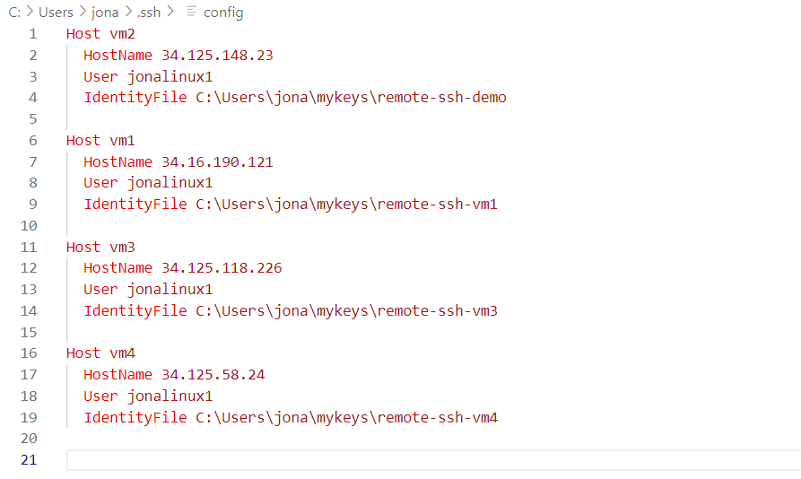

## Configuring and connecting to the virtual machines

**Skip this step if deploying only on local machine**

I used the Google Cloud test version which includes 3 months free access and 300$ of test credit which is significantly more than was needed for this project. Theoretically, this project could also be deployed on any other cloud provider such as AWS.

[Google Cloud](https://cloud.google.com/)

Steps:

1. Navigate to Compute Engine/VM instances; Click on Create Instance and specify:
   1. Name: Suggestion is to name the instance "vm1" however a different name is possibe
   2. Machine Type: e2-standard-2 (2 vCPU, 8 GB memory). For the first VM, used for simulating deployment on a single machine, I chose an 8GB RAM machine and for the other machines, used during multi-host deployment, I chose 4GB RAM
   3. Boot Disk:
      1. Operating System: Ubuntu
      2. Version: Ubuntu 22.04 LTS
      3. Size (GB): 30 GB
   4. Firewall: tick 'allow HTTP traffic' and 'allow HTTPS traffic'
2. We create a custom firewall setting thas exposes all ports of the VM. In a real-world deployment, this would not be secure and it would be better to single-handedly expose all the ports that are needed.
   1. Navigate to VPC network/Firewall on Google Cloud
   2. Click on create firewall rule:
      1. Under Targets add target tag "custom-firewall"
      2. under Source filters set IP ranges to 0.0.0.0/0
      3. under Protocols and Ports enable tcp and udp
   3. navigate back to VM instances, click on the vm instance, click on Edit, scroll down to network tags (right under firewall) and add "custom-firewall" as a tag
3. Establish a remote connection to the VM in VS Code
   1. On your desktop, open VS Code (I assume your operating system is Windows in the following)
      1. install the Remote - SSH extension by Microsoft
      2. Open the command palette, enter "Remote-SSH: Open SSH Configuration File" and choose C:\Users\username\ssh\config
      3. In the line "Host" change name to vm1, in the HostName line enter the IP address of the VM (external IP address as seen in Google Cloud). In the User line add the username you want to use for the machine (can be anything)
      4. Open a terminal: `mkdir mykeys` `cd mykeys` and then: `ssh-keygen -t rsa -f remote-ssh-vm1 -C username -b 2048` make sure to use the username added in config file, create password or leave empty
      5. This creats two files - public and private key
      6. Create a new line in the config file: _IdentityFile C:\Users\yourusername\mykeys\remote-ssh-vm1_
      7. 
      8. Open the public key file (remote-ssh-vm1.pub) and copy the entire content
   2. In the Google Cloud VM instances: click on Edit the vm1, scroll down to SSH Keys, click Add Item, paste the public Key, click Save
   3. In VS Code, open the remote connection window in the bottom left, click on "Remote-SSH: Connect to Host", click on vm1, click on Linux as operating system
   4. **remote connection should be established successfully**

**For speed and simplicity, we will set up the other virtual machines later and clone the disk from vm1. In a production environment this would be neither possible nor advisable.**

Move go into usr/local with following command such that our path points at the correct place. Otherwise you can also change the GOPATH below to /home/username/go

`sudo mv go/ /usr/local`

Now add the following lines into the .bashrc file (/home/username/.bashrc) which configures the terminal.

`export GOPATH=/usr/local/go*`

`export PATH=$PATH:$GOPATH/bin`

Since we will need this as well, also add this line to .bashrc:

`export PATH="/usr/local/go/src/fabric-samples/bin:$PATH"*`

# Creating the other VMs

To save time, we will create the other VMs by using just cloning the boot disk as the current VM, that way all the steps up to now will be copied. In a production environment, this wouldnt be advisable. It would be worse, however, if we created all cryptomaterials for all organisations on a single machine and then cloned the disk.

1. In Google Cloud /Compute Engine navigate to the section called disks (Laufwerke). Click the 3 little dots, click on clone disk, name it VM2.
2. In the VM instances section, click on create new VM instance and mirror setup for VM1. Under Bootdisk click on 'change' , navigate to existing disks and select disk of VM2 .
3. Under firewall settings make sure to enable HTTP and HTTPS server as well as adding the custom firewall setting.
4. Repeat this for VM3, VM4 and VM5
