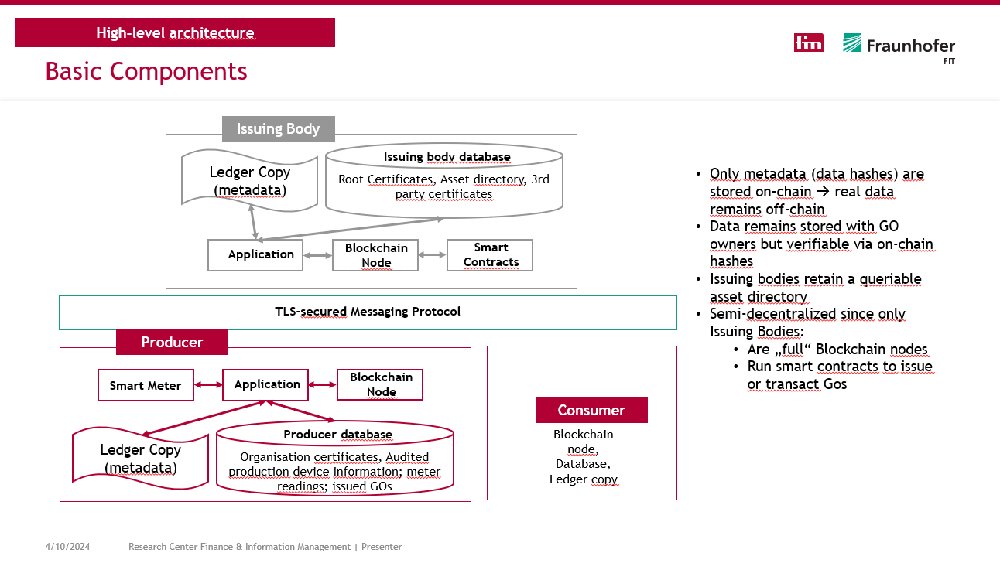
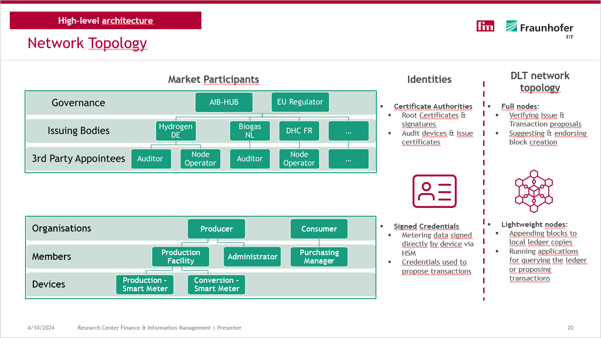
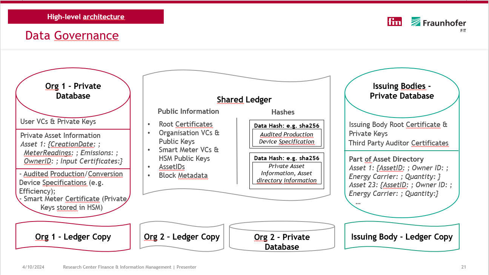
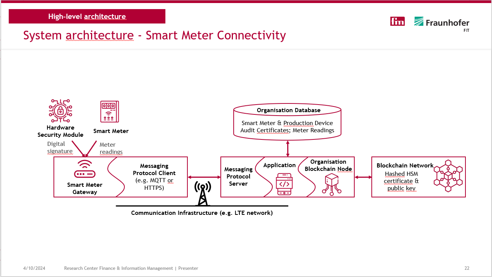
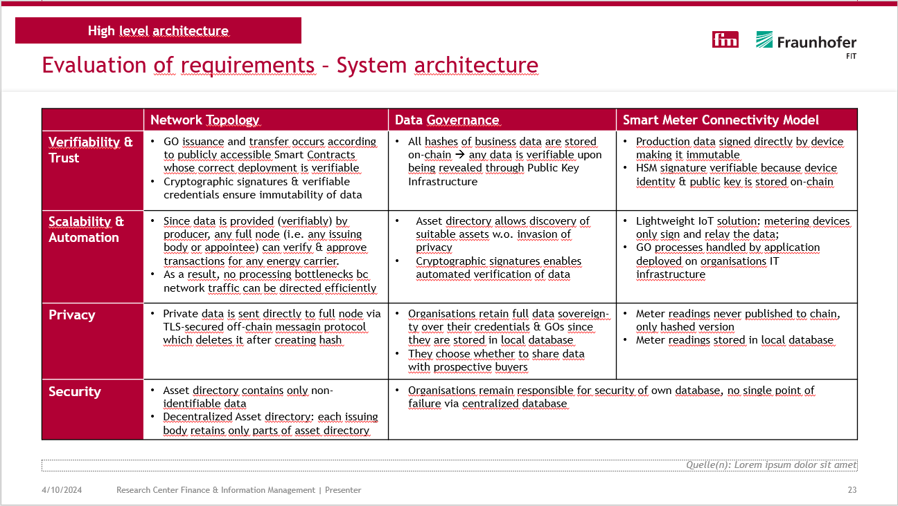
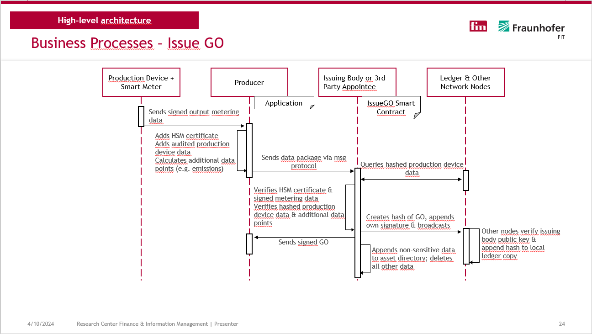
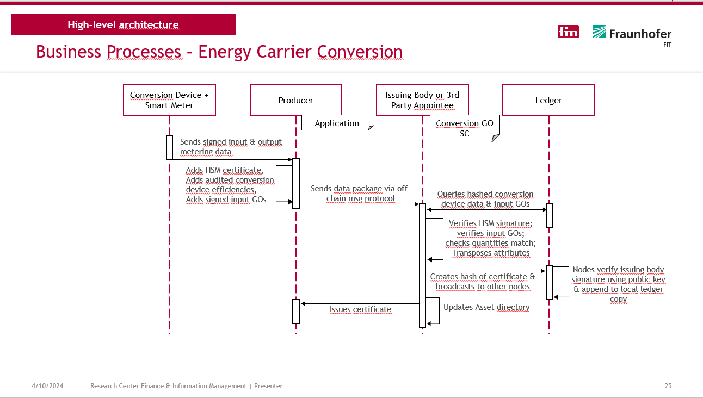
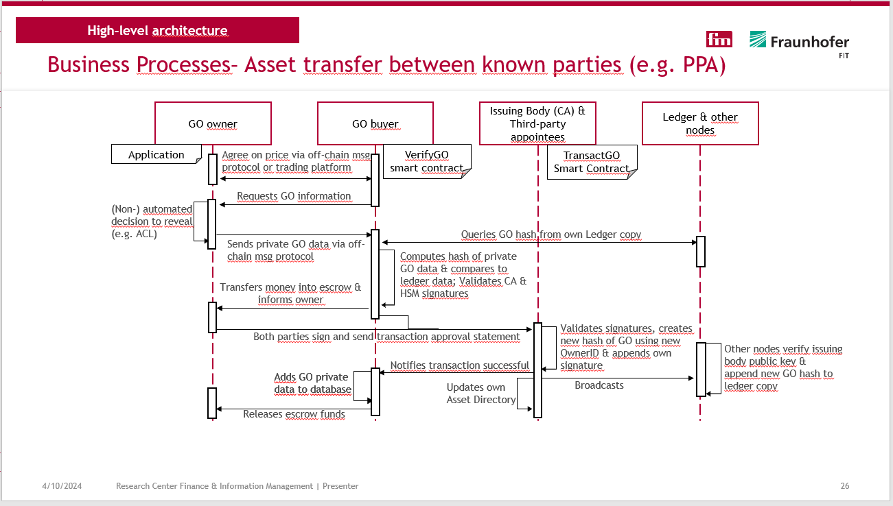
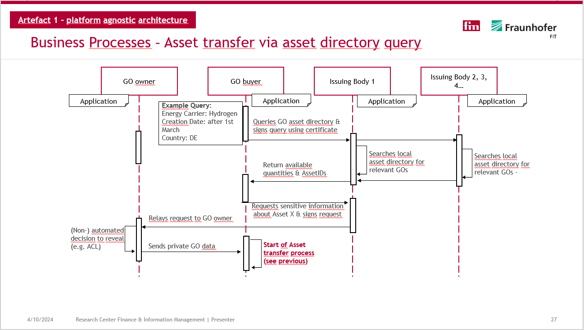

# High-level platform-agnostic architecture

As part of my research methodology (Design Science Research). I first designed a platform-agnostic high-level architecture based on the requirements that I used for the design of the prototype implementation.

---

---

---

---

---

---

---

---

---
