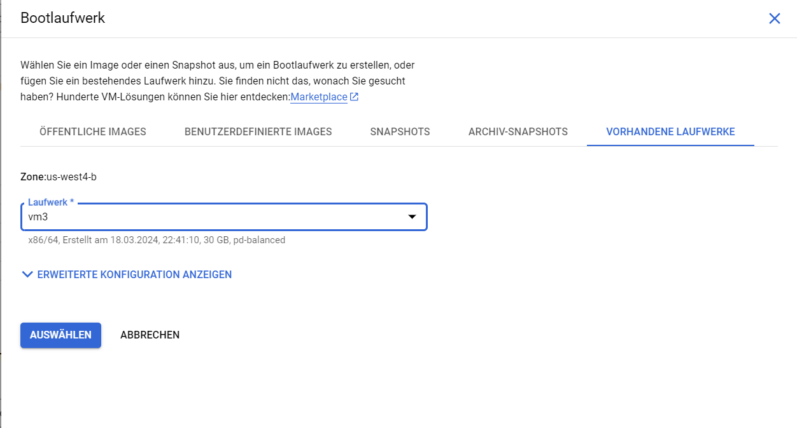

## 2. Installing all Prequisites, Fabric-Sample, Binaries and Docker Images

Im using docker version 25.0.4, docker-compose version 1.26.2, go 1.22.1, npm 10.2.4, python 2.7.18

Open the remote connection to VM1 in VS code (in the bottom left it should say: "SSH:vm1"). And open a terminal. We now need to install all the prerequisites on the VM.

`sudo apt-get install curl`
`sudo apt-get install nodejs`
`sudo apt-get install npm`
`sudo apt-get install python`

**Docker**

Im using the "install using the apt repository" method from the [Docker documentation](https://docs.docker.com/engine/install/ubuntu/) to install docker

`sudo apt-get update`
`sudo apt-get install ca-certificates curl`
`sudo install -m 0755 -d /etc/apt/keyrings`

`sudo curl -fsSL https://download.docker.com/linux/ubuntu/gpg -o /etc/apt/keyrings/docker.asc`

`sudo chmod a+r /etc/apt/keyrings/docker.asc`

```
echo \
  "deb [arch=$(dpkg --print-architecture) signed-by=/etc/apt/keyrings/docker.asc] https://download.docker.com/linux/ubuntu \
  $(. /etc/os-release && echo "$VERSION_CODENAME") stable" | \
  sudo tee /etc/apt/sources.list.d/docker.list > /dev/null
```

`sudo apt-get update`

`sudo apt-get install docker-ce docker-ce-cli containerd.io docker-buildx-plugin docker-compose-plugin`

`docker --version`
`docker-compose --version`

**Golang Installation**

We cant follow the normal [installation method](https://go.dev/doc/install) of downloading the tar ball onto our machine bc we are in VM. This command downloads the appropriate tar ball onto the VM and installs it:

`wget -c https://go.dev/dl/go1.22.1.linux-amd64.tar.gz -O - | tar -xz`

Move go into usr/local with following command such that our path points at the correct place. Otherwise you can also change the GOPATH below to /home/username/go

`sudo mv go/ /usr/local`

Now add the following lines into the .bashrc file (/home/username/.bashrc) which configures the terminal.

`export GOPATH=/usr/local/go*`

`export PATH=$PATH:$GOPATH/bin`

Since we will need this as well, also add this line to .bashrc:

`export PATH="/home/yourusername/fabric-samples/bin:$PATH"*`

**Fabric-Samples repo, Binaries and Docker Images**

I follow the installation process in the [Fabric Documentation](https://hyperledger-fabric.readthedocs.io/en/latest/install.html).

Get the install script:

`curl -sSLO https://raw.githubusercontent.com/hyperledger/fabric/main/scripts/install-fabric.sh && chmod +x install-fabric.sh`

Run without any flag to install all docker images, binaries and the samples repository:

`./install-fabric.sh`

**The [Fabric Documentation](https://hyperledger-fabric.readthedocs.io/en/latest/index.html) provides excellent tutorials on how to use the fabric-samples.**

# Download google-chrome for Linux Ubuntu VM

If you are running a Linux VM on a Windows machine, you will need to download the google chrome browser to access the applications (i.e. CouchDB and the client application) under this [LINK](https://linuxize.com/post/how-to-install-google-chrome-web-browser-on-ubuntu-20-04/). Open the google browser from the command line with `google-chrome-stable`.

When running applications, do not click on the little pop-up in the bottom-left "Your application is running on port X" to open the application. Instead open a new terminal window, open google chrome and then type in http://localhost:PORTNUMBER

# Clone the GO conversion issuance repo

Lets clone the repo. Either, make a fork of the repo and then download or download the repo directly. You need to have git installed. Go to the repo and copy the http address

`git clone http address`

# Creating the other VMs

To save time, we will create the other VMs by using just cloning the boot disk as the current VM, that way all the steps up to now will be copied. In a production environment, this wouldnt be advisable. It would be worse, however, if we created all cryptomaterials for all organisations on a single machine and then cloned the disk.

1. In Google Cloud /Compute Engine navigate to the section called disks (Laufwerke). Click the 3 little dots, click on clone disk, name it VM2.
2. In the VM instances section, click on create new VM instance and mirror setup for VM1. Under Bootdisk click on 'change' , navigate to existing disks and select disk of VM2 .
3. Under firewall settings make sure to enable HTTP and HTTPS server as well as adding the custom firewall setting.
4. Repeat this for VM3, VM4 and VM5
